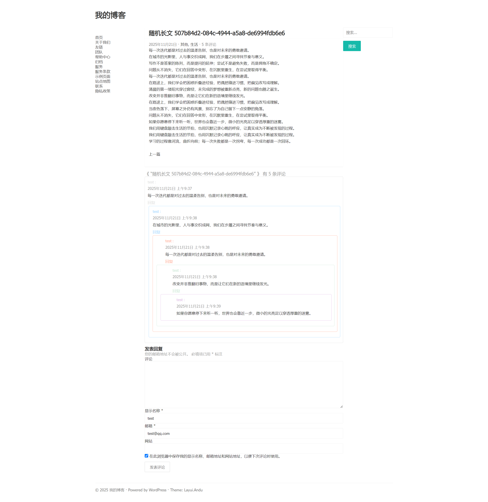

# LayuiAndu

以 Layui 框架为基础的极简 WordPress 博客主题，专注内容阅读体验与基础功能的稳健实现。

 

## 截图

## demo

- [LayuiAndu 演示站点](https://690003.xyz/)

## 特性

- 轻量、简洁，适合个人博客与技术文章
- 导航与分页等基础组件采用 Layui 风格
- 支持搜索结果关键词高亮
- 评论表单与层级样式优化
- 响应式布局，兼容移动端
- Layui 资源自动选择本地或 CDN（本地存在则优先本地）

## 安装

- 将主题文件夹 `layuiandu` 放入 `wp-content/themes/`
- 在 WordPress 后台的“外观 → 主题”中启用 LayuiAndu
- 如需本地加载 Layui，可在 `assets/vendor/layui/` 放置 `layui.css` 与 `layui.js`，或替换最新版的layui样式和js文件
- 当前使用layui 2.13.2 版本，建议保持最新版以获取最新功能与安全修复。[layui 官方下载链接](https://layui.dev/)

## 使用建议

- 在“外观 → 菜单”创建并分配 `主导航` 到主题位置
- 侧边栏支持搜索与自定义挂件（在“外观 → 小工具”中添加）
- 可通过 CSS 变量 `--accent` 自定义主题主色（已为默认蓝色）

## 兼容性

- WordPress 6.x
- PHP 7.4+ / 8.x

## 许可

- GPL-2.0-or-later

## 捐赠

## Star 历史

## 仓库

- https://github.com/andufox/layuiandu

